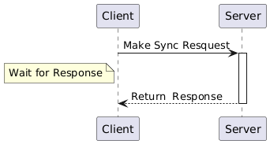
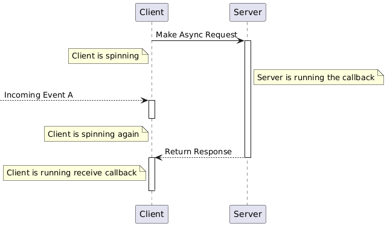

.. Tutorials/Intermediate/Async-Service

Writing a service with an asynchronous client node
==================================================

.. contents:: Table of Contents
   :depth: 2
   :local:

**Goal:** Understanding asynchronism in the context of services.

**Tutorial level:** Intermediate

**Time:** 20 minutes

Background
----------

For information on how to write a basic client/server service see :doc:`Writing a Simple Service and Client <../../Beginner-Client-Libraries/Writing-A-Simple-Cpp-Service-And-Client>`.

In this tutorial we will create a service server with a artificial delay and a service client that makes requests to the service server **inside a callback**.
We will use both to understand the concept of asynchronism and to evaluate the impact of timing in the design of services.

The delay in the server will make it easier to observe client activity; that activity is the difference between synchronous and asynchronous requests.

A **synchronous** client is idle (i.e. **doing nothing**) after making a request.
Once it receives the response it resumes execution with the statement immediately following the request.

Conversely, an **asynchronous** client can **continue running** after making the request, performing other tasks.
Later, it may either wait for the response or execute a predefined callback.
In this tutorial, the client will execute a callback when the response is received.

Consider the following diagram:

It shows a **synchronous** client.
The client makes a request and waits for the response, meaning its thread is blocked (i.e. not running) until the response is returned.

In contrast, the following diagram illustrates an asynchronous ROS 2 client:

.. In the definition diagram there is an invisible interaction, in white color, otherwise the activation bar could not be deactivated.

In general, an asynchronous client continues running after making the request.
Afterward, when the response is required to proceed, the thread could call a waiting function to stop until the response is received.
In a ROS 2 client, however, the thread must be spinning to receive the response.
This means it has to continuously poll for incoming events (topics, timers, etc.), including the response event.
This behavior is depicted in the diagram: when ``Event A`` is received, its callback is executed (the client is *activated*).
Later, the response is received, and the client executes the corresponding callback for the response.

Since any service client in ROS 2 must be spinning to receive the server's response, all clients in ROS 2 are inherently asynchronous by design.
Service requests cannot block the thread, and although they cannot simply wait, they can wait while spinning.

.. attention::

   **All** service **clients** in ROS 2 are **asynchronous**.

Thus, if a node is already spinning and has sent a request to a service inside a callback (any callback), the best approach is to allow the callback to finish.
You can write another callback to process the response, which will be executed at a later time in the future.
This approach might seem unintuitive because the code to be executed after receiving the response is not written immediately after the request is sent.
However, you will become accustomed to it; you simply need to write or locate that piece of code in a different place.

This tutorial demonstrates how to write an asynchronous client that operates as shown in the diagram.

Prerequisites
-------------

In beginner tutorials, you learned how to :doc:`create a workspace <../../Beginner-Client-Libraries/Creating-A-Workspace/Creating-A-Workspace>` and :doc:`create a package <../../Beginner-Client-Libraries/Creating-Your-First-ROS2-Package>`.

In :doc:`Writing a Simple cpp Service and Client <../../Beginner-Client-Libraries/Writing-A-Simple-Cpp-Service-And-Client>` you learned how to define a custom service that adds two ints, we will use that service again.

The source code for this tutorial is located at `rclcpp examples <https://github.com/ros2/examples/tree/{REPOS_FILE_BRANCH}/rclcpp/services>`.

Tasks
------

1 Creating the server package
^^^^^^^^^^^^^^^^^^^^^^^^^^^^^

In a shell run:

.. code-block:: bash

   ros2 pkg create --build-type ament_cmake --license Apache-2.0 examples_rclcpp_delayed_service --dependencies rclcpp example_interfaces

Update ``package.xml`` as usual.

1.1 Write the service server node
~~~~~~~~~~~~~~~~~~~~~~~~~~~~~~~~~~

Inside the ``examples_rclcpp_delayed_service/src`` directory, create a new file called ``main.cpp`` and paste the following code within:

.. code-block:: C++

   #include <memory>
   #include "example_interfaces/srv/add_two_ints.hpp"
   #include "rclcpp/rclcpp.hpp"

   class DelayedSumService : public rclcpp::Node
   {
   public:
   DelayedSumService()
   : Node("delayed_service")
   {
      // Declares a parameter for delaying (default to 2.0 seconds)
      this->declare_parameter("response_delay", 2.0);

      service_ = this->create_service<example_interfaces::srv::AddTwoInts>(
         "add_two_ints", std::bind(
                           &DelayedSumService::add_two_ints_callback, this, std::placeholders::_1,
                           std::placeholders::_2));

      RCLCPP_INFO(this->get_logger(), "DelayedSumService is ready.");
   }

   private:
   void add_two_ints_callback(
      const std::shared_ptr<example_interfaces::srv::AddTwoInts::Request> request,
      std::shared_ptr<example_interfaces::srv::AddTwoInts::Response> response)
   {
      // Gets parameter value
      double delay;
      this->get_parameter("response_delay", delay);

      auto result = request->a + request->b;
      RCLCPP_INFO_STREAM(
         this->get_logger(),
         "Request:" << request->a << " + " << request->b << " delayed " << delay << " seconds");

      // Simulates the delay
      std::this_thread::sleep_for(std::chrono::duration<double>(delay));

      response->sum = result;
      RCLCPP_INFO_STREAM(this->get_logger(), "Response: " << result);
   }

   rclcpp::Service<example_interfaces::srv::AddTwoInts>::SharedPtr service_;
   };

   int main(int argc, char ** argv)
   {
      rclcpp::init(argc, argv);
      auto node = std::make_shared<DelayedSumService>();
      rclcpp::spin(node);
      rclcpp::shutdown();
      return 0;
   }

Update ``CMakeLists.txt`` to build the executable: add the following lines to it (after finding packages):

.. code-block:: console

   add_executable(service_main main.cpp)
   ament_target_dependencies(service_main rclcpp example_interfaces)

   install(TARGETS service_main DESTINATION lib/${PROJECT_NAME})

Then install dependencies if you need:

.. code-block:: bash

   rosdep install -i --from-path src --rosdistro {DISTRO} -y

And build as usual:

.. code-block:: bash

   colcon build

1.2 Examine the server code
~~~~~~~~~~~~~~~~~~~~~~~~~~~

This node has a standard implementation with nothing special.

.. warning::

   This package is a service server with an arbitrary and artificial delay in responding to requests.
   It should not used unless the delay is removed.

2 Creating the client package
^^^^^^^^^^^^^^^^^^^^^^^^^^^^^

.. code-block:: bash

   ros2 pkg create --build-type ament_cmake --license Apache-2.0 examples_rclcpp_async_recv_cb_client --dependencies rclcpp example_interfaces

Update ``package.xml`` as usual.

2.1 Write the service client node
~~~~~~~~~~~~~~~~~~~~~~~~~~~~~~~~~~

Inside the ``examples_rclcpp_async_recv_cb_client/src`` directory, create a new file called ``main.cpp`` and paste the following code within:

.. code-block:: C++

   #include <rclcpp/rclcpp.hpp>
   #include <example_interfaces/srv/add_two_ints.hpp>
   #include <std_msgs/msg/int32.hpp>

   class AsyncReceiveCallbackClient : public rclcpp::Node
   {
      public:
      AsyncReceiveCallbackClient()
      : Node("examples_rclcpp_async_recv_cb_client")
      {
         // Create AddTwoInts client
         client_ = this->create_client<example_interfaces::srv::AddTwoInts>("add_two_ints");

         // Wait until service is avaible
         while (!client_->wait_for_service(std::chrono::seconds(1))) {
            RCLCPP_ERROR(this->get_logger(), "Service is not available, trying again after 1 second");
         }

         // Create a subcription to an input topic
         subscription_ = this->create_subscription<std_msgs::msg::Int32>(
            "input_topic", 10,
            std::bind(&AsyncReceiveCallbackClient::topic_callback, this, std::placeholders::_1));

         // Create a publisher for broadcasting the result
         publisher_ = this->create_publisher<std_msgs::msg::Int32>("output_topic", 10);

         RCLCPP_INFO(this->get_logger(), "DelayedSumClient Initialized.");
      }

      private:
      void topic_callback(const std::shared_ptr<std_msgs::msg::Int32> msg)
      {
         RCLCPP_INFO(this->get_logger(), "Received %d at topic.", msg->data);
         if (msg->data >= 0) {
            RCLCPP_INFO(this->get_logger(), "  Input topic is %d >= 0. Requesting sum...", msg->data);

            // Create request to sum msg->data + 100
            auto request = std::make_shared<example_interfaces::srv::AddTwoInts::Request>();
            request->a   = msg->data;
            request->b   = 100;

            // Calls the service and bind the callback to receive response (not blocking!)
            auto future_result = client_->async_send_request(
               request,
               std::bind(
                  &AsyncReceiveCallbackClient::handle_service_response, this, std::placeholders::_1));
         } else {
            RCLCPP_INFO(this->get_logger(), "  Input topic is %d < 0. No request is sent", msg->data);
         }
      }

      // Callback to receive response (call inside the spinning method like any other callback)
      void handle_service_response(
         rclcpp::Client<example_interfaces::srv::AddTwoInts>::SharedFuture future)
      {
         auto response = future.get();
         RCLCPP_INFO(this->get_logger(), "Response: %ld", response->sum);

         // Publish response at output topic
         auto result_msg = std_msgs::msg::Int32();
         result_msg.data = response->sum;
         publisher_->publish(result_msg);
      }

      rclcpp::Client<example_interfaces::srv::AddTwoInts>::SharedPtr client_;
      rclcpp::Subscription<std_msgs::msg::Int32>::SharedPtr subscription_;
      rclcpp::Publisher<std_msgs::msg::Int32>::SharedPtr publisher_;
   };

   int main(int argc, char ** argv)
   {
      rclcpp::init(argc, argv);
      rclcpp::spin(std::make_shared<AsyncReceiveCallbackClient>());
      rclcpp::shutdown();
      return 0;
   }

Update ``CMakeLists.txt`` to build the executable: add the following lines to it (after finding packages):

.. code-block:: console

   add_executable(client_main main.cpp)
   ament_target_dependencies(client_main rclcpp std_msgs example_interfaces)

   install(TARGETS client_main DESTINATION lib/${PROJECT_NAME})

And build as usual:

.. code-block:: bash

   colcon build

2.2 Examine the client code
~~~~~~~~~~~~~~~~~~~~~~~~~~~~

The code in this node:

* Creates a service client:

   .. code-block:: C++

      client_ = this->create_client<example_interfaces::srv::AddTwoInts>("add_two_ints");

* Waits for the service server to be avaible at constructing the node object:

   .. code-block:: C++

      while (!client_->wait_for_service(std::chrono::seconds(1))) {
         RCLCPP_ERROR(this->get_logger(), "Service is not available, trying again after 1 second");
      }

* And creates a suscriber and a publisher (nothing interesting here).

The node implements two callbacks, first one is for the subcription: ``topic_callback``, the request is sent here, **inside** this callback:

.. code-block:: C++

   void topic_callback(const std::shared_ptr<std_msgs::msg::Int32> msg)
   {
      RCLCPP_INFO(this->get_logger(), "Received %d at topic.", msg->data);
      if (msg->data >= 0) {
         RCLCPP_INFO(this->get_logger(), "  Input topic is %d >= 0. Requesting sum...", msg->data);

         // Create request to sum msg->data + 100
         auto request = std::make_shared<example_interfaces::srv::AddTwoInts::Request>();
         request->a   = msg->data;
         request->b   = 100;

         // Calls the service and bind the callback to receive response (not blocking!)
         auto future_result = client_->async_send_request(
            request,
            std::bind(
               &AsyncReceiveCallbackClient::handle_service_response, this, std::placeholders::_1));
      } else {
         RCLCPP_INFO(this->get_logger(), "  Input topic is %d < 0. No request is sent", msg->data);
      }
   }

This callback checks the topic value and, if it is greater than or equal to zero, prepares a request to the service using the new topic value and 100 as arguments, and then sends the request.

Key points about ``async_send_request`` are:

* It is called inside a callback, meaning it is executed in the thread that is spinning the node.

* It is non-blocking, meaning it returns almost immediately without stopping the execution of the thread.

* It accepts a callback as an argument, ``handle_service_response``, which is where the code will *jump* when the response is received.

* There are no additional statements after the call to ``async_send_request`` in ``topic_callback``, so execution will exit this callback and return to the spinning method.

* Keep in mind that the node must be spinning to receive the server response.

* The ``future_result`` object can be ignored since the response will be handled in ``handle_service_response`` using the argument.
  However, it can also be used to track the *state* of the request if necessary.

The callback ``handle_service_response`` is for receiving the server response.
Note that, as a callback, it will be promptly executed by the node's main thread when the response is received.
This behavior is similar to what occurs with subscriptions.

The code is quite simple:

.. code-block:: C++

  void handle_service_response(
    rclcpp::Client<example_interfaces::srv::AddTwoInts>::SharedFuture future)
  {
    auto response = future.get();
    RCLCPP_INFO(this->get_logger(), "Response: %ld", response->sum);

    // Publish response at output topic
    auto result_msg = std_msgs::msg::Int32();
    result_msg.data = response->sum;
    publisher_->publish(result_msg);
  }

The response is provided in the parameter ``future``.
The actual information is retrieved in the first line and logged on the second line.
Subsequently, the response can be processed as required.
In this example, it is simply published to a topic.

.. note::

   This is the code that is executed after receiving the response, and it is **not written** immediately **below** the statement that sends the request.
   If the client were synchronous, it will be written directly **after** the statement that sends the request.

Installing the examples directly
---------------------------------

You might get the packages directly from code sources (clone the git repository in a workspace and colcon build them) or if you are using Ubuntu, and you follow the `installation instructions <https://docs.ros.org/en/{REPOS_FILE_BRANCH}/Installation.html>`, you can install them using apt for your ROS 2 distro:

.. code-block:: bash

   sudo apt install ros-{REPOS_FILE_BRANCH}-examples_rclcpp_async_recv_cb_client ros-{REPOS_FILE_BRANCH}-examples_rclcpp_delayed_service

Study how client and server interact
------------------------------------

Whether you write the package yourself or directly install the examples, this section provides cases of study to illustrate how the client and server interact and the impact of execution timing on their interaction.

1 Discover available components
^^^^^^^^^^^^^^^^^^^^^^^^^^^^^^^

To see what packages contain the term *examples_* are available in your workspace, execute the following command in a terminal:

.. code-block:: bash

   ros2 pkg list | grep examples_

The terminal will show a list of packages whose name starts with *examples_*.
At least you should get:

.. code-block:: text

   examples_rclcpp_async_recv_cb_client
   examples_rclcpp_delayed_service

Just remember to source the workspace if you haven't already.

2 Run the delayed server
^^^^^^^^^^^^^^^^^^^^^^^^

Start a new terminal and run:

.. code-block:: bash

   ros2 run examples_rclcpp_delayed_service service_main

The service will start, in another terminal run:

.. code-block:: bash

   ros2 service call /add_two_ints example_interfaces/srv/AddTwoInts "{a: 2, b: 5}"

After a short delay, you will receive the response.
Return to the terminal where you launched the server, you will see two INFO log messages
indicating the time of the incoming request and the time when the response was sent.

.. warning::

   This server is designed to emulate a service that requires a significant amount of time to compute a response.

You might fine tune the timing by running:

.. code-block:: bash

   ros2 param set /delayed_service response_delay 2.5

With 2.5 as the new delay in seconds, keep this value to ensure sufficient time for the subsequent steps.

3 Run the asynchronous client
^^^^^^^^^^^^^^^^^^^^^^^^^^^^^

Start a new terminal and run (source the workspace, if you have to):

.. code-block:: bash

   ros2 run examples_rclcpp_async_recv_cb_client client_main

This node does not make a request upon launch.
Instead, the service call is sent when a topic is received.
That is, the call to ``async_send_request`` is **inside** a ROS 2 callback.
You need to publish to a topic to trigger the request.
Open a third terminal and run:

.. code-block:: bash

   ros2 topic pub --once /input_topic std_msgs/msg/Int32 "data: 5"

Check the messages in the terminals running the server and client.
You will observe that the client sent a request and received the response shortly afterward.
On the server side, you will see the matching messages, confirming the interaction.

Now, how can we confirm this client is asynchronous?
Being asynchronous means that the program does not stop and wait for a result.
Instead, it continues running and performing other tasks while waiting for the response.
This is true for **all** ROS 2 service clients because they must keep spinning to handle incoming responses from the *rclcpp* layer.

.. note::

   In this example, the client is the asynchronous node.
   Applying the term asynchronous to the server in this context does not make sense.

Let's see these concepts in action.
Run the following commands one after the other.
If you're not fast enough, you can increase the delay time to a higher value.
You can also copy and paste the commands directly into your terminal:

.. code-block:: bash

   ros2 topic pub --once /input_topic std_msgs/msg/Int32 "data: 10"
   ros2 topic pub --once /input_topic std_msgs/msg/Int32 "data: 15"

Check the client terminal.
You should see output similar to the following:

.. code-block:: text

   [INFO] [1733332216.902893640] [examples_rclcpp_async_recv_cb_client]: Received 10 at topic.
   [INFO] [1733332216.902928394] [examples_rclcpp_async_recv_cb_client]:   Input topic is 10 >= 0. Requesting sum...
   [INFO] [1733332218.457559892] [examples_rclcpp_async_recv_cb_client]: Received 15 at topic.
   [INFO] [1733332218.457593992] [examples_rclcpp_async_recv_cb_client]:   Input topic is 15 >= 0. Requesting sum...
   [INFO] [1733332219.403816764] [examples_rclcpp_async_recv_cb_client]: Response: 110
   [INFO] [1733332221.904430291] [examples_rclcpp_async_recv_cb_client]: Response: 115

Since the client **is** asynchronous, it keeps spinning and continues to receive topic messages.
In the previous logs, the topics for values 10 and 15 were received at times ending in 16 and 18 seconds, respectively, and the responses were received later.
This means two requests were made in quick succession before their results were received, and the responses were processed later.
But why does the second response take more than 2.5 seconds?

Now check the terminal running the server.
You should see output similar to the following:

.. code-block:: text

   [INFO] [1733332216.903081355] [delayed_service]: Request:10 + 100 delayed 2.5 seconds
   [INFO] [1733332219.403276302] [delayed_service]: Response: 110
   [INFO] [1733332219.403700193] [delayed_service]: Request:15 + 100 delayed 2.5 seconds
   [INFO] [1733332221.903918827] [delayed_service]: Response: 115

The server logs two messages in its service callback: one message when the request is received and another when the response is sent.
The client sent the request with values ``15 + 100`` at a time ending in 18.45 seconds, but the server logs the matching message at 19.40 seconds.
What is happening here?

Actually, it is quite simple.
The server is spinning, just like any other node, and this server only has one thread.
Therefore, the first callback, which processed the request with arguments ``10+100``, **blocked** the spinning thread until it completed and returned.
Once it finished, the spinning resumed, and processed the next incoming request by calling the callback with arguments: ``15+100``.
While it might seem like the requests are handled in parallel, that is not the case.
When a **Single-Threaded Executor** is used, only one thread is available, and the callbacks are executed strictly in sequence.

The key concept here is that an asynchronous call, like in the client, does not **block** execution.
As a result, after processing the callback containing the request, the client node regains control and continues spinning.
This enables the client node to execute callbacks for other incoming messages, including topic messages **and** incoming responses.

The client node also uses a **Single-Threaded Executor**, so callbacks are processed sequentially.
However, the difference is that callbacks in the client return almost immediately.
This gives the impression that the client is always ready to handle new events, as it should be.

Another important lesson is that service requests should be made with caution.
If requests are sent at a high frequency, the server's efficiency in generating responses must be considered to prevent it from being overwhelmed.

.. note::

   In any circumstance, it is advisable to monitor callback execution times, as they **block** spinning and can lead to unexpected and undesirable side effects.

As a final note, designing a service server that takes too long to compute a response can become a significant issue in your system.
This limitation is one of the reasons why using *actions* is often preferred in such cases.

Summary
--------

You have created an **asynchronous** client node designed to integrate seamlessly with other ROS 2 events, such as topics, timers, and more.
Its execution model is straightforward, operating in the default single-threaded mode.

Through experiments on the effects of blocking callbacks and timing, you should have gained valuable insight into the concept of **asynchronism** and its impact on code design.
