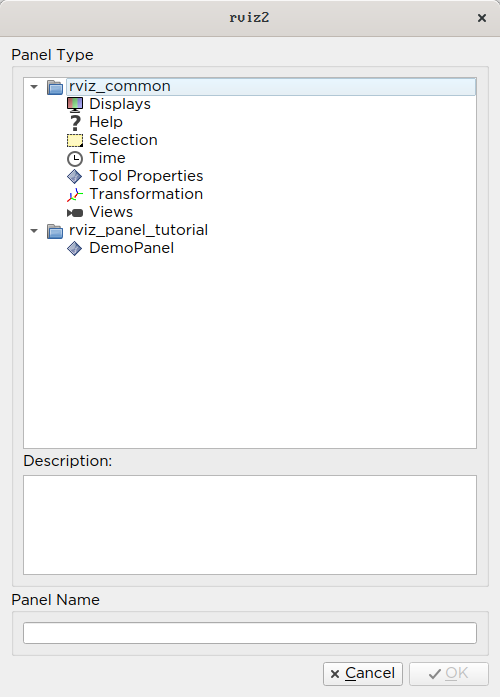
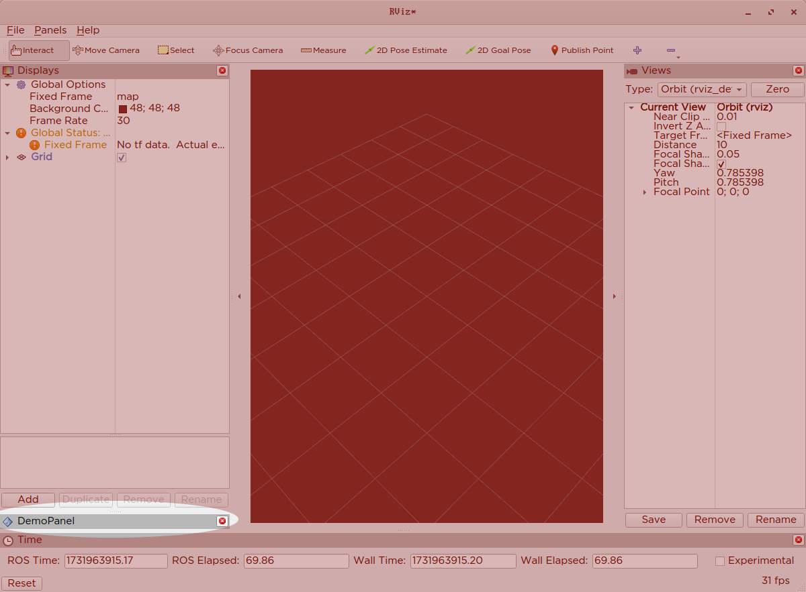
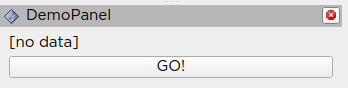
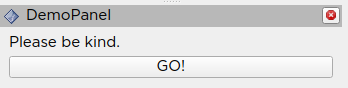
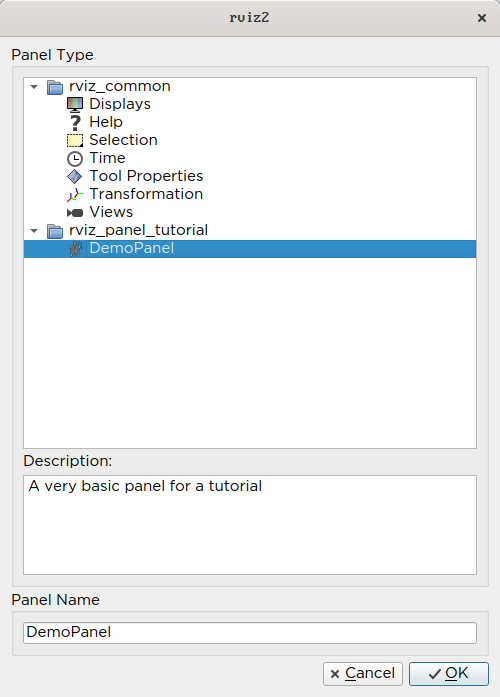
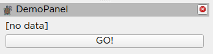

Building a Custom RViz Panel
============================

This tutorial is for people who would like to work within the RViz environment to either display or interact with some data in a two-dimensional environment.

In this tutorial you will learn how to do three things within RViz:

* Create a new QT panel within RViz.
* Create a topic subscriber within RViz that can monitor messages published on that topic and display them within the RViz panel.
* Create a topic publisher such button presses within RViz publish to an output topic in ROS.

All of the code for this tutorial can be found in `this repository <https://github.com/MetroRobots/rviz_panel_tutorial>`__.

Boilerplate Code
----------------

Header File
^^^^^^^^^^^

Here are the contents of ``demo_panel.hpp``

.. code-block:: c++

   #ifndef RVIZ_PANEL_TUTORIAL__DEMO_PANEL_HPP_
   #define RVIZ_PANEL_TUTORIAL__DEMO_PANEL_HPP_

   #include <rviz_common/panel.hpp>

   namespace rviz_panel_tutorial
   {
   class DemoPanel
     : public rviz_common::Panel
   {
     Q_OBJECT
   public:
     explicit DemoPanel(QWidget * parent = 0);
     ~DemoPanel() override;
   };
   }  // namespace rviz_panel_tutorial

   #endif  // RVIZ_PANEL_TUTORIAL__DEMO_PANEL_HPP_

* We're extending the `rviz_common::Panel <https://github.com/ros2/rviz/blob/9a94bdf2f5f92ccdac4037c9268b95940845d609/rviz_common/include/rviz_common/panel.hpp#L46>`__ class.
* `For reasons outside the scope of this tutorial <https://doc.qt.io/qt-5/moc.html>`__, you need the ``Q_OBJECT`` macro in there to get the QT parts of the GUI to work.
* We start by declaring just a constructor and destructor, implemented in the cpp file.

Source File
^^^^^^^^^^^

``demo_panel.cpp``

.. code-block:: c++

   #include <rviz_panel_tutorial/demo_panel.hpp>

   namespace rviz_panel_tutorial
   {
   DemoPanel::DemoPanel(QWidget* parent) : Panel(parent)
   {
   }

   DemoPanel::~DemoPanel() = default;
   }  // namespace rviz_panel_tutorial

   #include <pluginlib/class_list_macros.hpp>
   PLUGINLIB_EXPORT_CLASS(rviz_panel_tutorial::DemoPanel, rviz_common::Panel)

* Overriding the constructor and deconstructor are not strictly necessary, but we can do more with them later.
* In order for RViz to find our plugin, we need this ``PLUGINLIB`` invocation in our code (as well as other things below).

package.xml
^^^^^^^^^^^

We need the following dependencies in our package.xml:

.. code-block:: xml

     <depend>pluginlib</depend>
     <depend>rviz_common</depend>

rviz_common_plugins.xml
^^^^^^^^^^^^^^^^^^^^^^^

.. code-block:: xml

   <library path="demo_panel">
     <class type="rviz_panel_tutorial::DemoPanel" base_class_type="rviz_common::Panel">
       <description></description>
     </class>
   </library>

* This is standard ``pluginlib`` code.

  * The library ``path`` is the name of the library we'll assign in the CMake.
  * The class should match the ``PLUGINLIB`` invocation from above.

* We'll come back to the description later, I promise.

CMakeLists.txt
^^^^^^^^^^^^^^

Add the following lines to the top of the standard boilerplate.

.. code-block:: cmake

   find_package(ament_cmake_ros REQUIRED)
   find_package(pluginlib REQUIRED)
   find_package(rviz_common REQUIRED)

   set(CMAKE_AUTOMOC ON)
   qt5_wrap_cpp(MOC_FILES
     include/rviz_panel_tutorial/demo_panel.hpp
   )

   add_library(demo_panel src/demo_panel.cpp ${MOC_FILES})
   target_include_directories(demo_panel PUBLIC
     $<BUILD_INTERFACE:${CMAKE_CURRENT_SOURCE_DIR}/include>
     $<INSTALL_INTERFACE:include>
   )
   ament_target_dependencies(demo_panel
     pluginlib
     rviz_common
   )
   install(TARGETS demo_panel
           EXPORT export_rviz_panel_tutorial
           ARCHIVE DESTINATION lib
           LIBRARY DESTINATION lib
           RUNTIME DESTINATION bin
   )
   install(DIRECTORY include/
           DESTINATION include
   )
   install(FILES rviz_common_plugins.xml
           DESTINATION share/${PROJECT_NAME}
   )
   ament_export_include_directories(include)
   ament_export_targets(export_rviz_panel_tutorial)
   pluginlib_export_plugin_description_file(rviz_common rviz_common_plugins.xml)

* To generate the proper Qt files, we need to

  * Turn ``CMAKE_AUTOMOC`` on.
  * Wrap the headers by calling ``qt5_wrap_cpp`` with each header that has ``Q_OBJECT`` in it.
  * Include the ``MOC_FILES`` in the library alongside our other cpp files.

* A lot of the other code ensures that the plugin portion works.
  Namely, calling ``pluginlib_export_plugin_description_file`` is essential to getting RViz to find your new plugin.

Testing it out
^^^^^^^^^^^^^^

Compile your code, source your workspace and run ``rviz2``.

In the top Menu bar, there should be a "Panels" menu.
Select "Add New Panel" from that menu.

A dialog will pop up showing all the panels accessible in your ROS environment, grouped into folders based on their ROS package.
Create a new instance of your panel by either double clicking on its name, or selecting it and clicking OK.

This should create a new panel in your RViz window, albeit with nothing but a title bar with the name of your panel.

Filling in the Panel
--------------------
We're going to update our panel with some very basic ROS/QT interaction.
What we will do, roughly, is access the ROS node from within RViz that can both subscribe and publish to ROS topics.
We will use our subscriber to monitor an ``/input`` topic within ROS and display the published ``String`` values in the widget.
We use our publisher to map button presses within RViz to messages published on a ROS topic named ``/output`` .

Updated Header File
^^^^^^^^^^^^^^^^^^^

Update ``demo_panel.hpp`` to include the following includes and class Body.

.. code-block:: c++

   #include <rviz_common/panel.hpp>
   #include <rviz_common/ros_integration/ros_node_abstraction_iface.hpp>
   #include <std_msgs/msg/string.hpp>
   #include <QLabel>
   #include <QPushButton>

   namespace rviz_panel_tutorial
   {
   class DemoPanel : public rviz_common::Panel
   {
     Q_OBJECT
   public:
     explicit DemoPanel(QWidget * parent = 0);
     ~DemoPanel() override;

     void onInitialize() override;

   protected:
     std::shared_ptr<rviz_common::ros_integration::RosNodeAbstractionIface> node_ptr_;
     rclcpp::Publisher<std_msgs::msg::String>::SharedPtr publisher_;
     rclcpp::Subscription<std_msgs::msg::String>::SharedPtr subscription_;

     void topicCallback(const std_msgs::msg::String & msg);

     QLabel* label_;
     QPushButton* button_;

   private Q_SLOTS:
     void buttonActivated();
   };
   }  // namespace rviz_panel_tutorial

* On the ROS side, we declare an abstract node pointer, which we will use to create interfaces to the wider ROS ecosystem.
  We have a subscriber which will allow us to take information from ROS and use it in RViz.
  The publisher allows us to publish information/events from within RViz and make them available in ROS.
  We also have methods an initialization method for setting up the ROS components (``onInitialize``) and a callback for the subscriber (``topicCallback``).
* On the QT side, we declare a label and a button, as well as a callback for the button (``buttonActivated``).

Updated Source File
^^^^^^^^^^^^^^^^^^^

Update ``demo_panel.cpp`` to have the following contents:

.. code-block:: c++

   #include <rviz_panel_tutorial/demo_panel.hpp>
   #include <QVBoxLayout>
   #include <rviz_common/display_context.hpp>

   namespace rviz_panel_tutorial
   {

   DemoPanel::DemoPanel(QWidget* parent) : Panel(parent)
   {
     // Create a label and a button, displayed vertically (the V in VBox means vertical)
     const auto layout = new QVBoxLayout(this);
     // Create a button and a label for the button
     label_ = new QLabel("[no data]");
     button_ = new QPushButton("GO!");
     // Add those elements to the GUI layout
     layout->addWidget(label_);
     layout->addWidget(button_);

     // Connect the event of when the button is released to our callback,
     // so pressing the button results in the buttonActivated callback being called.
     QObject::connect(button_, &QPushButton::released, this, &DemoPanel::buttonActivated);
   }

   DemoPanel::~DemoPanel() = default;

   void DemoPanel::onInitialize()
   {
     // Access the abstract ROS Node and
     // in the process lock it for exclusive use until the method is done.
     node_ptr_ = getDisplayContext()->getRosNodeAbstraction().lock();

     // Get a pointer to the familiar rclcpp::Node for making subscriptions/publishers
     // (as per normal rclcpp code)
     rclcpp::Node::SharedPtr node = node_ptr_->get_raw_node();

     // Create a String publisher for the output
     publisher_ = node->create_publisher<std_msgs::msg::String>("/output", 10);

     // Create a String subscription and bind it to the topicCallback inside this class.
     subscription_ = node->create_subscription<std_msgs::msg::String>("/input", 10, std::bind(&DemoPanel::topicCallback, this, std::placeholders::_1));
   }

   // When the subscriber gets a message, this callback is triggered,
   // and then we copy its data into the widget's label
   void DemoPanel::topicCallback(const std_msgs::msg::String & msg)
   {
     label_->setText(QString(msg.data.c_str()));
   }

   // When the widget's button is pressed, this callback is triggered,
   // and then we publish a new message on our topic.
   void DemoPanel::buttonActivated()
   {
     auto message = std_msgs::msg::String();
     message.data = "Button clicked!";
     publisher_->publish(message);
   }

   }  // namespace rviz_panel_tutorial

   #include <pluginlib/class_list_macros.hpp>

   PLUGINLIB_EXPORT_CLASS(rviz_panel_tutorial::DemoPanel, rviz_common::Panel)

Testing with ROS
^^^^^^^^^^^^^^^^
Compile and launch RViz2 with your panel again. You should see your label and button in the panel now.

To change the label, we simply have to publish a message on the ``/input`` topic, which you can do with this command:

.. code-block:: bash

   ros2 topic pub /input std_msgs/msg/String "{data: 'Please be kind.'}"

Since the widget is subscribed to this topic, it will trigger the callback and change the text of the label.

Pressing the button will publish a message, which you can see by echoing the ``/output`` topic, like with this command.

.. code-block:: bash

   ros2 topic echo /output

Cleanup
-------

Now its time to clean it up a bit.
This makes things look nicer and be a little easier to use, but aren't strictly required.

First, you should update the description of your plugin in ``rviz_common_plugins.xml``

We also add an icon for the plugin at ``icons/classes/DemoPanel.png``.
The folder is hardcoded, and the filename should match the name from the plugin declaration (or the name of the class if not specified).

We need to install the image file in the CMake.

.. code-block:: cmake

   install(FILES icons/classes/DemoPanel.png
           DESTINATION share/${PROJECT_NAME}/icons/classes
   )

Now when you add the panel, it should show up with an icon and description.

The panel will also have an updated icon.

